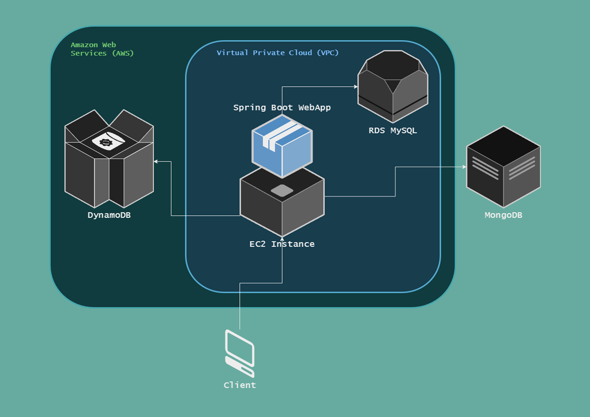
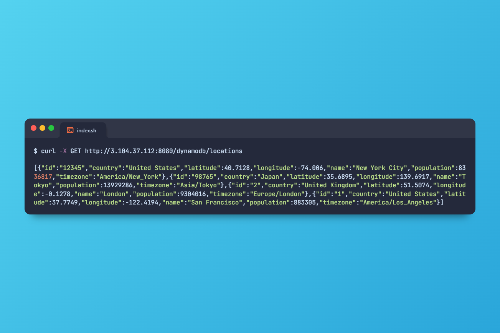
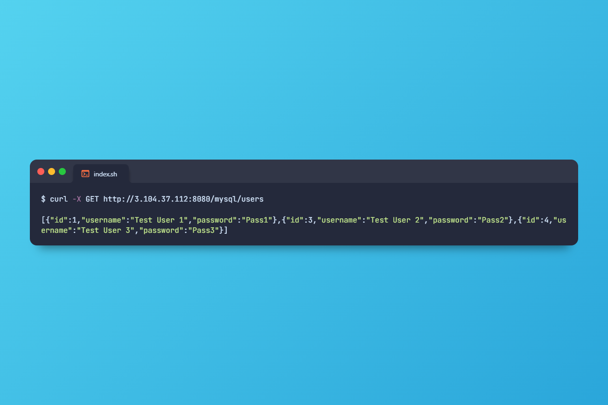
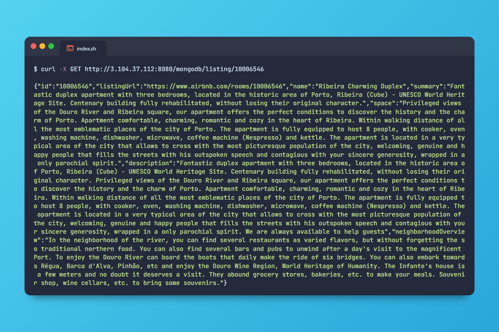
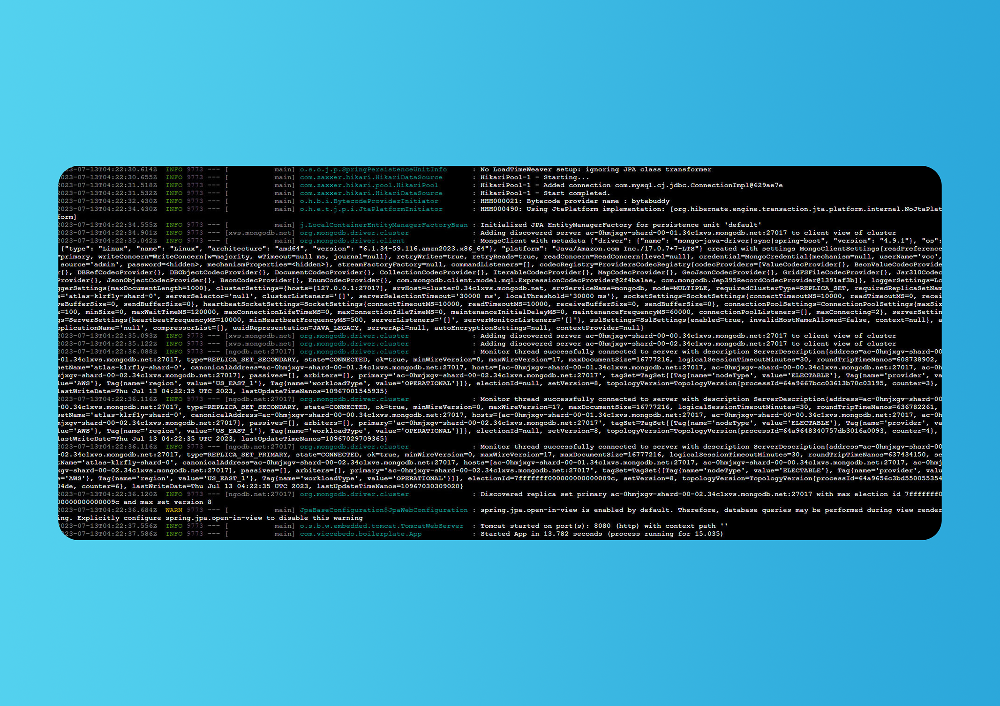

# Boilerplate for Java Spring AWS EC2 RDS DynamoDB MongoDB

This project demonstrates the seamless integration of multiple AWS services such as EC2, RDS, DynamoDB, and MongoDB Cloud into a Spring Boot web application. It provides a robust and scalable architecture that can be utilized as a reusable template for future projects.

The modular design of the architecture allows for easy adaptation and extension, making it a valuable boilerplate for similar projects. By leveraging preconfigured AWS services and database integrations, developers can save significant time and effort in setting up the infrastructure.

The project's focus is on empowering future projects by providing a solid foundation. Developers can build upon this architecture, accelerating development timelines and reducing costs. It serves as a practical starting point, enabling seamless integration with AWS services and facilitating efficient data management.

With this project, teams can quickly kickstart their projects, benefiting from the proven integration of AWS services and the flexibility of MongoDB Cloud. It offers a scalable solution that promotes optimal performance and supports the growth of future applications.

> Java Spring Boot AWS system architecture design.

> REST request to get AWS DynamoDB (NoSQL) data.

> REST request to get AWS RDS (MySQL) data.

> REST request to get MongoDB Cloud data.

> Java Spring Boot WebApp running on AWS EC2.
